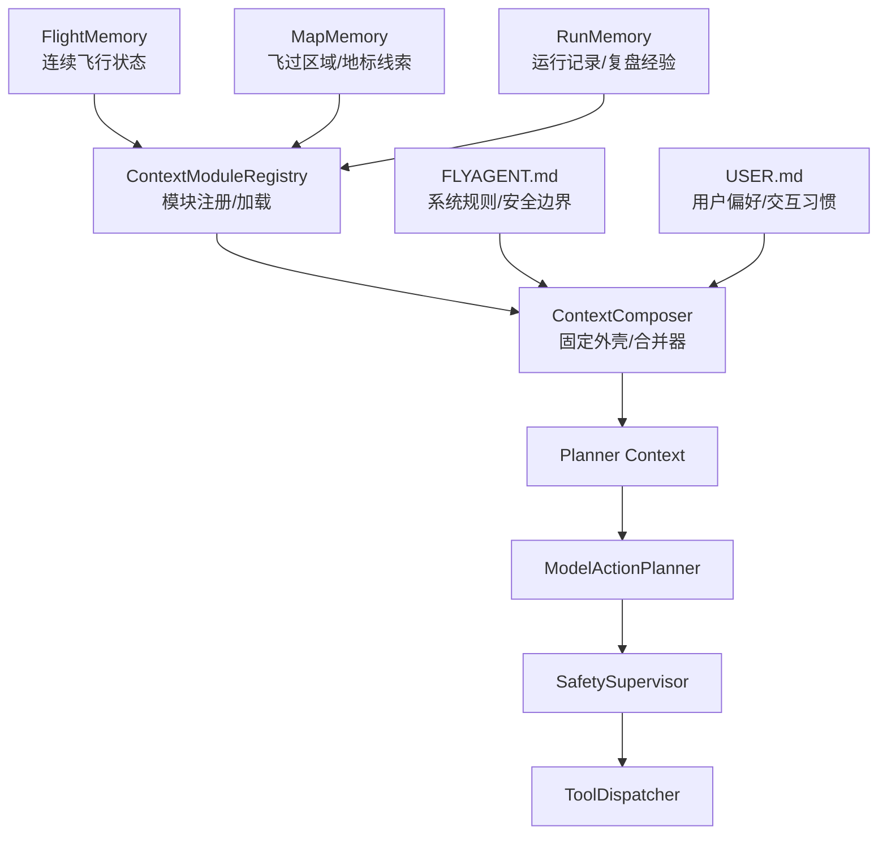
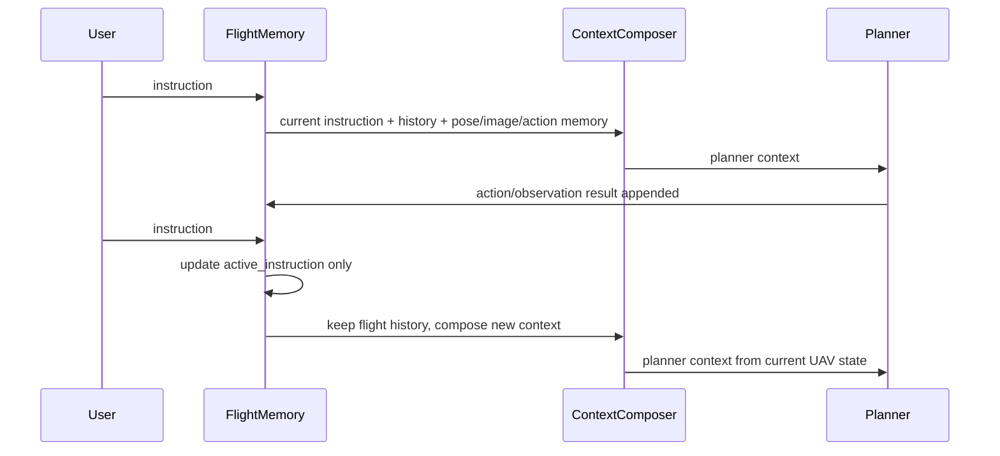
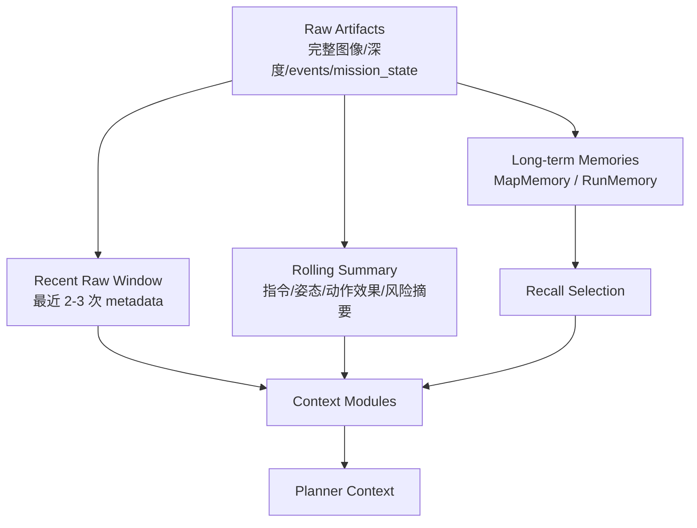
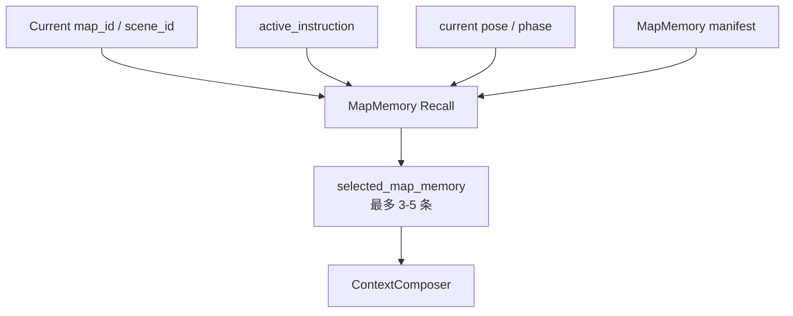
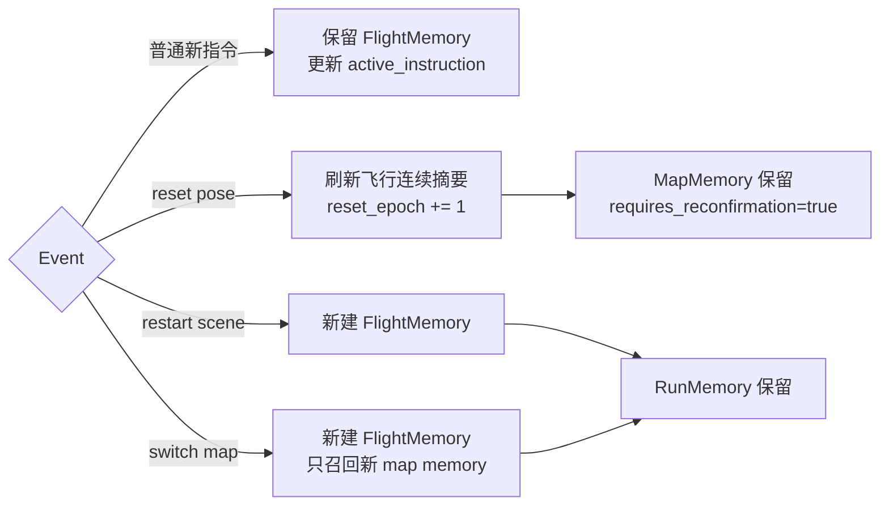
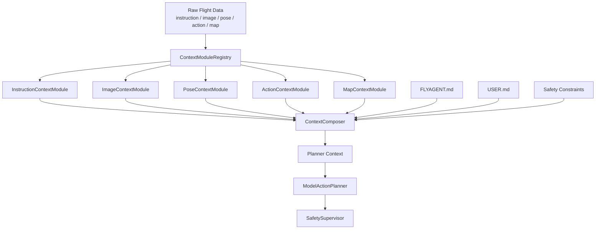
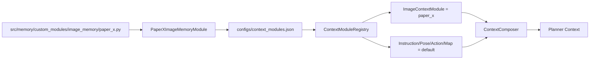
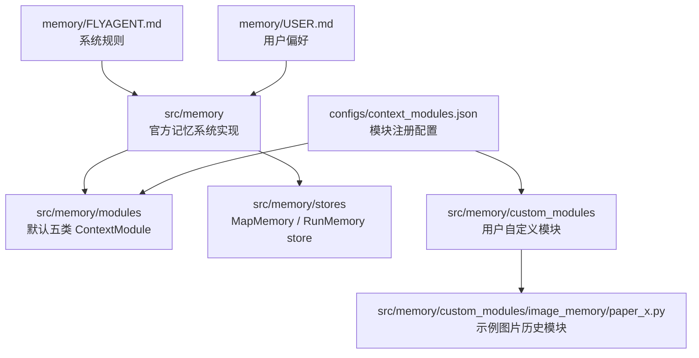

# 07 图示汇总

本文件集中保存记忆系统的关键图，方便快速评审。

## 1. 总体分层

```mermaid
flowchart TD
    A["FLYAGENT.md<br/>系统规则/安全边界"]
    B["USER.md<br/>用户偏好/交互习惯"]
    C["FlightMemory<br/>连续飞行状态"]
    D["MapMemory<br/>飞过区域/地标线索"]
    E["RunMemory<br/>运行记录/复盘经验"]
    R["ContextModuleRegistry<br/>模块注册/加载"]
    F["ContextComposer<br/>固定外壳/合并器"]

    C --> R
    D --> R
    E --> R
    R --> F
    A --> F
    B --> F

    F --> G["Planner Context"]
    G --> H["ModelActionPlanner"]
    H --> I["SafetySupervisor"]
    I --> J["ToolDispatcher"]
```

## 2. 连续指令

```mermaid
sequenceDiagram
    participant U as User
    participant FM as FlightMemory
    participant CC as ContextComposer
    participant PL as Planner

    U->>FM: instruction #1
    FM->>CC: current instruction + history + pose/image/action memory
    CC->>PL: planner context
    PL->>FM: action/observation result appended

    U->>FM: instruction #2
    FM->>FM: update active_instruction only
    FM->>CC: keep flight history, compose new context
    CC->>PL: planner context from current UAV state
```

## 3. 历史压缩

```mermaid
flowchart TD
    A["Raw Artifacts<br/>完整图像/深度/events/mission_state"] --> B["Recent Raw Window<br/>最近 2-3 次 metadata"]
    A --> C["Rolling Summary<br/>指令/姿态/动作效果/风险摘要"]
    A --> D["Long-term Memories<br/>MapMemory / RunMemory"]

    B --> E["Context Modules"]
    C --> E
    D --> F["Recall Selection"]
    F --> E
    E --> G["Planner Context"]
```

## 4. MapMemory 召回

```mermaid
flowchart TD
    A["Current map_id / scene_id"] --> D["MapMemory Recall"]
    B["active_instruction"] --> D
    C["current pose / phase"] --> D
    E["MapMemory manifest"] --> D
    D --> F["selected_map_memory<br/>最多 3-5 条"]
    F --> G["ContextComposer"]
```

## 5. Reset 记忆边界

```mermaid
flowchart LR
    A{"Event"}
    A -->|普通新指令| B["保留 FlightMemory<br/>更新 active_instruction"]
    A -->|reset pose| C["刷新飞行连续摘要<br/>reset_epoch += 1"]
    A -->|restart scene| D["新建 FlightMemory"]
    A -->|switch map| E["新建 FlightMemory<br/>只召回新 map memory"]

    C --> F["MapMemory 保留<br/>requires_reconfirmation=true"]
    D --> G["RunMemory 保留"]
    E --> G
```

## 6. 插件架构总图

```mermaid
flowchart TD
    A["Raw Flight Data<br/>instruction / image / pose / action / map"] --> R["ContextModuleRegistry"]

    R --> I["InstructionContextModule"]
    R --> IMG["ImageContextModule"]
    R --> P["PoseContextModule"]
    R --> ACT["ActionContextModule"]
    R --> M["MapContextModule"]

    I --> C["ContextComposer"]
    IMG --> C
    P --> C
    ACT --> C
    M --> C

    F["FLYAGENT.md"] --> C
    U["USER.md"] --> C
    S["Safety Constraints"] --> C

    C --> O["Planner Context"]
    O --> PL["ModelActionPlanner"]
    PL --> SF["SafetySupervisor"]
```

## 7. 用户替换 ImageContextModule

```mermaid
flowchart LR
    A["src/memory/custom_modules/image_memory/paper_x.py"] --> B["PaperXImageMemoryModule"]
    B --> C["configs/context_modules.json"]
    C --> D["ContextModuleRegistry"]
    D --> E["ImageContextModule = paper_x"]
    D --> F["Instruction/Pose/Action/Map = default"]
    E --> G["ContextComposer"]
    F --> G
    G --> H["Planner Context"]
```

## 8. 推荐目录结构

```mermaid
flowchart TD
    A["src/memory<br/>官方记忆系统实现"]
    B["src/memory/modules<br/>默认五类 ContextModule"]
    C["src/memory/stores<br/>MapMemory / RunMemory store"]
    D["configs/context_modules.json<br/>模块注册配置"]
    E["memory/FLYAGENT.md<br/>系统规则"]
    F["memory/USER.md<br/>用户偏好"]
    G["src/memory/custom_modules<br/>用户自定义模块"]
    H["src/memory/custom_modules/image_memory/paper_x.py<br/>示例图片历史模块"]

    A --> B
    A --> C
    D --> B
    D --> G
    E --> A
    F --> A
    G --> H
```
